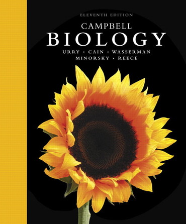

# Welcome to Bio 40 at Chaffey College

Please read this syllabus very carefully.

## Introduction to Cell and Molecular Biology -- Fall 2020

* Instructor: Dr. Senanu Spring-Pearson
* Class times: Online 'lecture' material
* Lab times: Mon 8:00-11:50 in BL-101
* E-mail: [senanu.springpearson@chaffey.edu](mailto:senanu.springpearson@chaffey.edu)
* Phone: 909-652-7876 (please use email instead)
* Final exam: 12/7/2020

## Course Description

An intensive course designed to prepare students for upper division courses in cell and molecular biology. Topics include biochemical, structural, metabolic, and genetic aspects of cells. Laboratory will include experimental design, a variety of techniques (e.g. microscopy, spectrophotometry,  electrophoresis), and data analysis.

## Student Learning Outcomes

At the completion of the course, students will:

* Develop an understanding of structural and functional relationships at the level of cells and molecules.
* Develop a logic-based approach to understanding metabolic processes involved in how cells exchange matter and energy with their environment.
* Demonstrate a familiarity with the molecular and cellular basis of biological diversity and inheritance as the basis for evolutionary change.
* Demonstrate skills in scientific thinking, communication, problem solving, and experimental methodology, using examples from cellular and molecular biology.
* Distinguish between different types of scientific literature and develop reading strategies to analyze/evaluate/interpret the different categories and components of scientific literature.
* Demonstrate skills in writing using the style of biological sciences and format of scientific literature.

## Required Text:  

Urry et al., 2017. Campbell Biology, 11th ed. Pearson.
This is a big, heavy, expensive book, but it will be invaluable to you as a budding biologist. This is also the book that you will continue to use through the introductory biology classes at Chaffey and so is worth investing in. Previous editions are only slightly different, so you are welcome to use those.

New textbooks may be bought with a code to Pearson's online learning content. You are welcome to use those, but none of it will be required for this class.

## Course Design:
This course is designed as a hybrid lecture/lab course in which you will learn the majority of the material online *and* attend a lab section. Due to the requirements of social distancing during the coronavirus pandemic, we will do short, 2-hour labs. Because of this time restriction (normally we should have 4-hour labs), you must come to lab fully prepared to do the lab and collect any data within those 2 hours.

For the lecture portion fo the class, I will record many short mini-lectures and reading guides for you to complete. I suggest you watch the lectures, then read the textbook, fill out the reading guide, and then re-watch the videos for each chapter. There will also be other online activities to encourage you to learn actively and for me to evaluate your understanding.

## Course Website:
I will post all materials to this course website and link to it from Canvas. Generally, I will provide hard copies of reading guides and lab material. If you miss class, please print the material from this website.

Although you may want to fill in the reading guides online, I encourage you to write on hard-copies. In my experience, students who try to do the reading guides on their computers tend to copy-paste material and that defeats the purpose of learning actively. Additionally, many questions will require you to draw diagrams.

## Accommodations
Students who need special accommodation through DPS must talk to me about the accommodations necessary. I will strictly honor any arrangements you have made through DPS (such as 1.5 time for exams).

## Exams and Quizzes
Each exam will consist of a combination of true/false, multiple-choice, short answer, and mostly short essay questions. The final exam will be cumulative!

Because you may (depending on the status of community health) be taking the exams at home, you may be allowed to use your textbook and other materials at your disposal. Although this sounds easy, there are costs!
1. The exam questions will be tough.
2. You must complete the exams in a short period of time. This will make it difficult for you to search online (or your textbook) for answers.
3. You must not copy from other students.

You will therefore need to study hard in order to do well on these exams.

## Make-up exams, attendance, and punctuality
In general, there will be no make-up exams. In the case of serious illness, please contact me to see what arrangements can be made.  

You are expected to attend lab each session and you must document any absences. Missing more than 2 sessions will make it very difficult to pass the course.

If you do not miss more than 2 lab session, then I will replace your lowest exam grade with your final exam grade if it improves your grade. If you miss 3 or more lab sessions, you will not benefit from this replacement. Additionally, if you are late more than twice, being tardy will start to count as absences after the second time.

Due to the COVID-19 pandemic, you are encouraged to stay at home if you are feeling any symptoms. If you feel symptoms, I will probably ask you to get a coronavirus test as documentation and will excuse such absences.

## Withdrawing from course
It is the student’s responsibility to drop the course if you stop attending. Failure to do so may result in a grade of ‘F’. Incompletes are only given in special circumstances when students meet all requirements as defined by the college.

## Academic integrity
Unethical behavior including copying other students work will not be tolerated. Students will receive zero points for the assignment and perhaps the course and will be referred to the Dean of Student Services, according to college policy.

Many of the assignments we do in class will be collaborative and I encourage you to work together with your teammates. When you work together, you will undoubtedly have very similar answers. However, the work that you turn in should be your own work and be presented in your own words, even if you have collaborated on it. You need to be particularly careful about this for work you do on a computer, as it is easily copied. Each student should take care to not copy others’ work as well as to safeguard their own work from being copied. Both students may be penalized for copied work. **Cheating and plagiarism is a big, huge deal in college. Scientists who copy have lost their jobs and reputations. Students who copy have been suspended or expelled from colleges.**

## Grade disputes
If you disagree with the grade on any assignment or exam, you must inform me of your concerns within 1 week of me returning the exam to the class. No re-grading will be done after a week.

## Communication
The students that regularly receive the highest grades are those that engage and communicate with their instructors. I encourage you to ask questions in and out of class and talk to me about your work, the material, or anything else pertinent.

## Assignments
You will be turning in many small assignments as well as your reading guides. Late assignments won't be accepted.

Full lab reports will be turned in using turnitin.com. I will give you rubrics for lab reports. You will also be responsible for editing and proofreading your classmates’ lab reports. You will be given credit for submitting drafts completed and on time and for the extent to which your editing has the potential to help your classmate.

Late papers will be deducted 20% of the possible points per calendar day, including later in the day on the due date.

## Grading

3 Exams | 300 points
1 final exam | 200 points
3 full lab reports | 150 points  
Reading guides  |  ~ 60 points (approx)
Miscellaneous assignments and quizzes  |  ~ 100 points (approx)
**Total**   |  **Approximately 810 points**

## Grade scale
* 90-100% = A
* 80-90% = B
* 70–80% = C
* 60-70% = D
* <60% = F

## Keys to Success:

* **Commitment**: School is your job and is probably the best job you could have right now!
* **Come to class**: The easiest way to learn the material and earn points is to attend class. Don’t waste that opportunity!
* **Participate**: If you are actively involved in learning and asking/answering questions in class, you will assimilate and understand the course content much better than if you sit passively.
* **Leave enough time for study**: You should plan to spend about 2-3 hours before and after class reading and studying material from lecture for every hour of lecture. Yes, this means at least 5 hours per week!
* **Review frequently**: You forget less and less material after each time you study it, so review material regularly.
Study in groups: Group study is much more fun and effective than studying on your own.
* **Organization**: Keep good notes. Make and use flash cards. Plan your time.
* **Preparation**: Read the material before class. Then, re-read all or portions of it after class. Do the reading guides carefully and thoughtfully.
* **Goals**: Get your work done on time. Don’t procrastinate. Follow a reasonable schedule.
* **Health**: Schedule work and play. Don’t take more courses than your home life can handle.
* **Keep up**: Don’t get behind — it’ll be really difficult to catch up on old material while you’re trying to stay up-to-date on the newer material. Let me say it again: Don’t get behind, don’t get behind, don’t get behind!

## More Important Dates
* **9/14** Last day to add the class
* **9/24** Last day to drop without a ‘W’
* **11/3** Last day to drop the course with a ‘W’
* **12/7** Final exam.

## Useful Chaffey College Resources

[Student Success Centers](https://www.chaffey.edu/studentsupport/success-centers.php)	|	Chino – CHMB-145
	|			Rancho – Library
[Disability Programs & Services](https://www.chaffey.edu/studentsupport/dps/index.php) |	(909) 652-6379
[Honors Program](https://www.chaffey.edu/programsacademics/honors.php) |		Rancho – SSA-122
[EOPS](https://www.chaffey.edu/studentsupport/eops/index.php) & [CARE](https://www.chaffey.edu/studentsupport/eops/care.php) |			(909) 652-6345
[Career Center](https://www.chaffey.edu/careercenter/index.php) |			Rancho – MACC-203
[Transfer Center](https://www.chaffey.edu/studentsupport/transfer/index.php) | 			(909) 652-6233
[Student Health Services](https://www.chaffey.edu/wellness/health-services.php) |		Chino CHMB-105
	|			Rancho – MACC-202
[Veteran Services](https://www.chaffey.edu/spops/veterans.php) |	(909) 652-6235
